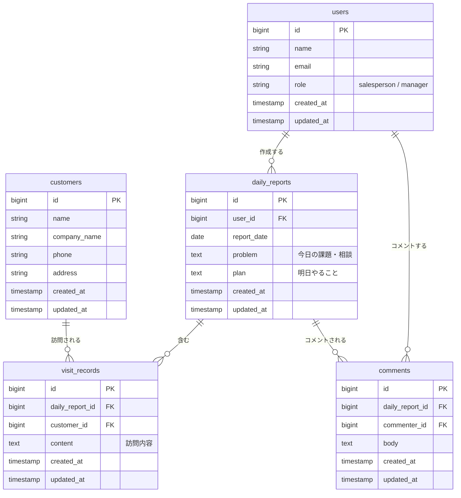

# ER図

```mermaid
erDiagram
    users {
        bigint id PK
        string name
        string email
        string role "salesperson / manager"
        timestamp created_at
        timestamp updated_at
    }

    customers {
        bigint id PK
        string name
        string company_name
        string phone
        string address
        timestamp created_at
        timestamp updated_at
    }

    daily_reports {
        bigint id PK
        bigint user_id FK
        date report_date
        text problem "今日の課題・相談"
        text plan "明日やること"
        timestamp created_at
        timestamp updated_at
    }

    visit_records {
        bigint id PK
        bigint daily_report_id FK
        bigint customer_id FK
        text content "訪問内容"
        timestamp created_at
        timestamp updated_at
    }

    comments {
        bigint id PK
        bigint daily_report_id FK
        bigint commenter_id FK
        text body
        timestamp created_at
        timestamp updated_at
    }

    users ||--o{ daily_reports : "作成する"
    daily_reports ||--o{ visit_records : "含む"
    customers ||--o{ visit_records : "訪問される"
    daily_reports ||--o{ comments : "コメントされる"
    users ||--o{ comments : "コメントする"
```
